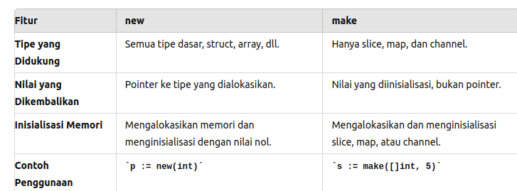

## referensi
1. LEARN GOLANG AND PYTHON QUICKLY CODING FOR BEGINNERS WITH HANDS ON PROJECTS BY J J TAM
2. chatgpt
3. [Understanding Allocations: the Stack and the Heap - GopherCon SG 2019](https://www.youtube.com/watch?v=ZMZpH4yT7M0)
4. [Belajar golang concurrency gampang](https://www.youtube.com/watch?v=fHxCpoF88Qg)
5. go for devpos
6. [beljar clean architecture dari youtube backend magang](https://github.com/medivh13/for_learning_2)

## hal penting yang harus dipejari
goroutin dan sinkronisasi, pointer(Constant Pointer VS. Pointer To A Constant ), struct pointer, interface, constuctor(go tidak punya buat manual), pointer function, new pointer, rune, multitrade, chanel, chanel buffer, heap & stack, stack gorutine, garbage colection, escape heap, no escape?, curency= multitrading?, pararellism, goroutines vs thread?, asyncronus, itoa, atoi
- Goroutine
- Channel, Blocking Channel, Buffered Size Channel
- Range dan Channel Closing
- Select dan Default Selection
- asyc await?
- deadlock?
- race condition
- time management: time.Sleep, sync.WaitGroup
- thread lebih ringan => goroutine

## verb
%v: Menampilkan nilai dalam format default. ./
%T: Menampilkan tipe dari nilai.
%d: Menampilkan angka desimal (untuk tipe integer).
%b: Menampilkan angka dalam format biner.
%c: Menampilkan karakter yang diwakili oleh nilai Unicode.
%x: Menampilkan angka dalam format heksadesimal (huruf kecil).
%X: Menampilkan angka dalam format heksadesimal (huruf besar).
%f: Menampilkan angka desimal (untuk tipe floating point).
%e: Menampilkan angka dalam notasi ilmiah (huruf kecil).
%E: Menampilkan angka dalam notasi ilmiah (huruf besar).
%s: Menampilkan string. tet jooko
%q: Menampilkan string yang dikutip.
%p: Menampilkan pointer (alamat memori).

## new vs make

## Go Lang Passing By Value

Ingat, Go secara default menggunakan **passing by value**, artinya perubahan apapun terhadap variabel asli tidak berpengaruh apapun dan hanya dianggap salinan, 

KECUALI PAKAI POINTER!!!!!

##### * dibaca pointer ke .... 
contoh: *int dibaca pointer ke int, *intPtr dibaca pointer ke variabel intPtr

##### & dibaca alamaat dari
contoh: &employee dibaca alamat dari employee
  
